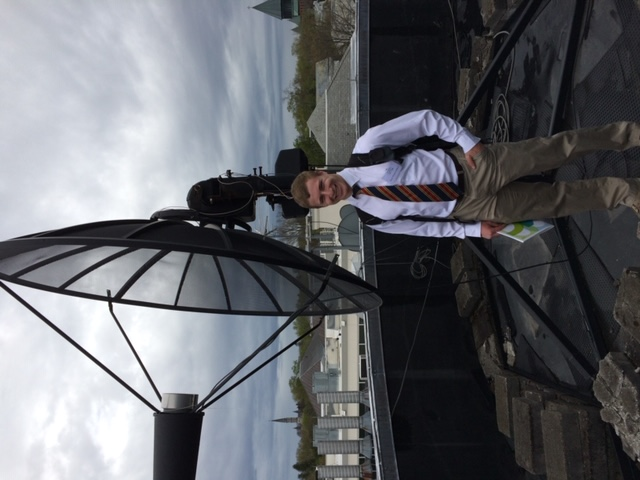

I'm currently the Science Writer & Community Advocate for [Universe Sandbox](https://universesandbox.com/), a physics-based space simulator masquerading as a video game. I have the amazing job of interacting with our users and getting to write about all of the awesome science and simulations that Universe Sandbox can do (as well as its limitations).

## The Before Times:

Before I started working at Giant Army (the company that makes Universe Sandbox) I got my Ph.D. in physics from West Virginia University in Spring 2021. While in grad school, I worked for Prof. Maura McLaughlin and was a member of the North American Nanohertz Observatory for Gravitational Waves ([NANOGrav](http://nanograv.org/)) Collaboration, which uses pulsar timing arrays to detect nanohertz gravitational waves.

My research involved pulsars, pulsar timing, studying how the interstellar medium affects pulsar signals, and a little bit of searching the skies for new pulsars. More on that [here](research.md).

## My (much too long) Story:

I am originally from a small town in the northwest corner of Connecticut. My Dad taught high school physics, and my Mom was the director of our town's local historical society. While I always was interested in science, my favorite subject was history. When I was applying to college, I wanted to study history and work in a museum. 

I ended up at Union College in Schenectady, NY, a small liberal arts school. My Mom spent the entirety of my first semester convincing me to study science, any science, instead of history. As you can probably guess, she was successful in this endeavor, and I decided I would study biology. Only, I couldn't get into a biology class, and I ended up in introductory physics instead. I didn't like physics. So I figured I'd tried, and I'd get a science credit and then go back to history.

But I ended up really liking physics. It was challenging, where history wasn't (at least for me). I was even more excited when I learned that I could study astronomy through physics because I was super into Dr. Who at the time. After my sophomore year, I spent the summer doing research on the small radio telescope with a professor at Union.

Me with the small radio telescope I worked on at Union College circa May 2016

The following summer, I had the opportunity to do a research experience for undergraduates (REU) at Cornell University, where I first heard of neutron stars and pulsars. After that, I decided to go to graduate school and continue researching pulsars. I applied to graduate schools that Autumn and ended up at West Virginia University.

While there, I started doing a lot of science outreach and education (learn more about that [here](outreach.md)). Over the years, I realized that what I wanted to do was continue doing science communication through demos, writing, or what have you, and got lucky enough to land my current job as the Science Writer & Community Advocate for Universe Sandbox.

## Hobbies:

In addition to science-related activities, I enjoy hiking, watching sports, brewing beer, reading (particularly fantasy and science fiction), and video games. 

Recently I've been reading Brandon Sanderson's Stormlight Archives, and I enjoy playing 2-D platforms, like Shovel Knight and Hollow Knight (though I like many other games too).

Me at Holly River State Park in West Virginia, Fall 2020.

## Contact:

If you’d like to get in touch with me, you can email me at bshapiroalbert@gmail.com or find me on twitter @bshapiroalbert.
