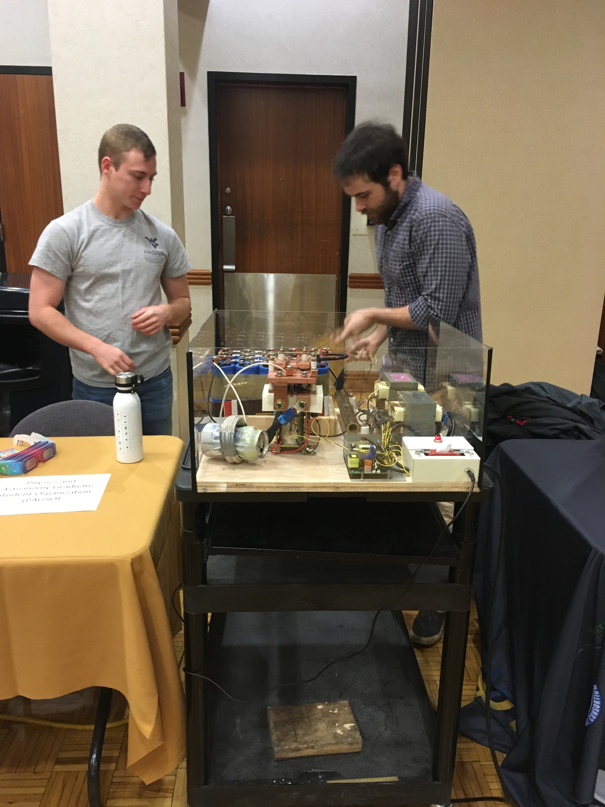

I really enjoy science outreach and education, and I think it is one of, if not the, most important activities that scientists can engage in. Though that may not come as a surprise since I now do science communication for a living!

Discussing our research and communicating it with the public is the most effective way to get people excited about science. When students and adults can participate in science demonstrations (here in particular physics demos), they can learn and feel like they can understand and do science. It inspires students to follow STEM paths, become more science literate, and learn critical thinking skills, which they will use throughout their lives. 

I have participated in and organized many different science outreach events, mainly through West Virginia University and the Physics and Astronomy Graduate Student Organization. I have volunteered at the Spark! Science Museum in Morgantown, WV, presented physics demos at many elementary schools in and around Morgantown, WV for their STEM nights, and hosted a demonstration table at the  Kids Day in the Park event hosted by the Katherine Johnson NASA IV&V Center in Fairmont, WV. I have also participated in the [Adopt-a-Physicist](https://www.adoptaphysicist.org/) online forum, which is a fantastic way to engage with high school students across the United States.

I also always want to improve my outreach and communication skills. I have done this was by participating in the American Astronomical Societies Astronomy Ambassadors workshop, as well as through lots of practice and trial-and-error. I also wrote for [Astrobites](https://astrobites.org/), where I summarized academic journal articles for physics and astronomy undergraduates and enthusiasts. The writers there are fantastic, and I highly recommend everybody check out the articles there. If you're interested in my articles you can find them [here](https://astrobites.org/author/bshapiroalbert/).

Me (left) and another graduate student presenting our electromagnetic can crusher at an outreach event at WVU.

I'm proudest of the Community Physics Festival that I organized with another graduate student at WVU in July 2019. We organized a full day program of physics demos, public lab tours, arts and crafts, public lectures, and a solar filter on the WVU Department of Physics and Astronomy's 16-in Celestron optical telescope. We also worked with the WVU Planetarium to run planetarium shows and celebrate the 50th anniversary of the Moon Landing. The event was mostly run by undergraduate and graduate students, with 28 volunteers, and over 300 visitors over the course of the day. You can see the schedule we put together for the Festival [here](https://eberly.wvu.edu/news-events/events/072019community-physics-festival) and some local new coverage we got [here](https://www.wdtv.com/content/news/WVU-holds-physics-festival-512995711.html?fbclid=IwAR2o1sX_8WwpsBVkkg1hRkus-uMR0Pys_-oYZuaGtmsv5EGUBgdbhvt7Nts) and [here](https://www.wboy.com/news/monongalia/people-of-all-ages-enjoy-wvu-physics-festival/?fbclid=IwAR3rdg3wJyXzLSEDPkRdDrZZdTSTi37Za03LeTWQkzxZVqoMsrOAbnVu5MY)!

More outreach events I have been a part of can be found on my CV, and I have a list of videos, activities, and other resources for scientists and students alike if you're interested in learning more. If you'd like to talk more with me about science outreach, I would be happy to hear from you!

