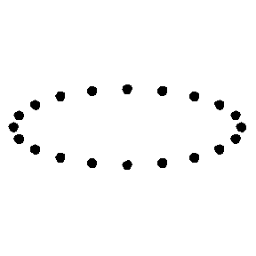
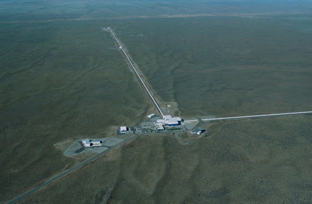

[Gravitational waves](https://www.ligo.caltech.edu/page/what-are-gw) are ripples in space-time caused by the rotation of massive objects. In particular, massive objects in binary systems, like pairs of neutron stars or black holes, emit gravitational waves, similar to the gif shown below (credit: R. Hurt - Caltech / JPL ).

The emission of gravitational waves is a consequence of Albert Einstein’s [Theory of Relativity](https://www.space.com/17661-theory-general-relativity.html). So detecting gravitational waves is one way to confirm this theory, as well as a way to study objects that we otherwise cannot see with electromagnetic radiation, such as black holes. The indirect evidence of gravitational waves came from observations of a pulsar-neutron star binary system often referred to as the [Hulse-Taylor binary system](https://astrobites.org/2018/02/02/looking-back-at-the-hulse-taylor-binary-pulsar/), after the astronomers who discovered it. As the system orbits, it losses energy from gravitational wave emission, so the size of the orbit shrinks. This was observed in this system to match predictions from general relativity, and the discovery was awarded a Nobel Prize in Physics in 1993.

## The First Direct Detection

As gravitational waves move through space, they squeeze and stretch space time (by very tiny amounts). This is shown in the animation below. If a gravitational wave was moving out of the screen at you, it would squeeze and stretch the space as it moves, though the actual amount space is changed is so small that you wouldn’t be able to see it with your eye.

Animation credit: https://commons.wikimedia.org/wiki/File:GravitationalWave_PlusPolarization.gif

So one way to detect these waves is to look at changes in distance as the gravitational waves propagate. Enter the Laser Interferometer Gravitational-Wave Observatory, or [LIGO](https://www.ligo.caltech.edu/). This set of two detectors works to detect gravitational waves by looking at changes in the light interference pattern between two lasers, one of which shown below. The laser arms of LIGO are each 4 kilometers long, and as the gravitational wave passes through the arms of the observatory, the distance of one arm gets stretched while the other gets squished. This changes the way the light from the lasers is recombined, and means a gravitational wave has been detected. But the distance change is less than a billionth of the width of a proton so it’s very hard to detect these signals! This [video](https://www.ligo.caltech.edu/video/IFO-response) by the LIGO team shows this better than I can explain it with words, so you should check it out!

LIGO detector in Hanford, WA. The other detector looks similar and is in Livingston, LA. Image Credit: Caltech/MIT/LIGO Lab

LIGO detected its first gravitational waves from a pair of merging black holes in September 2015, and was awarded a Nobel Prize in Physics for this detection in 2017. Since the first detection, LIGO has detected many more pairs of merging black holes, and even merging neutron stars!

