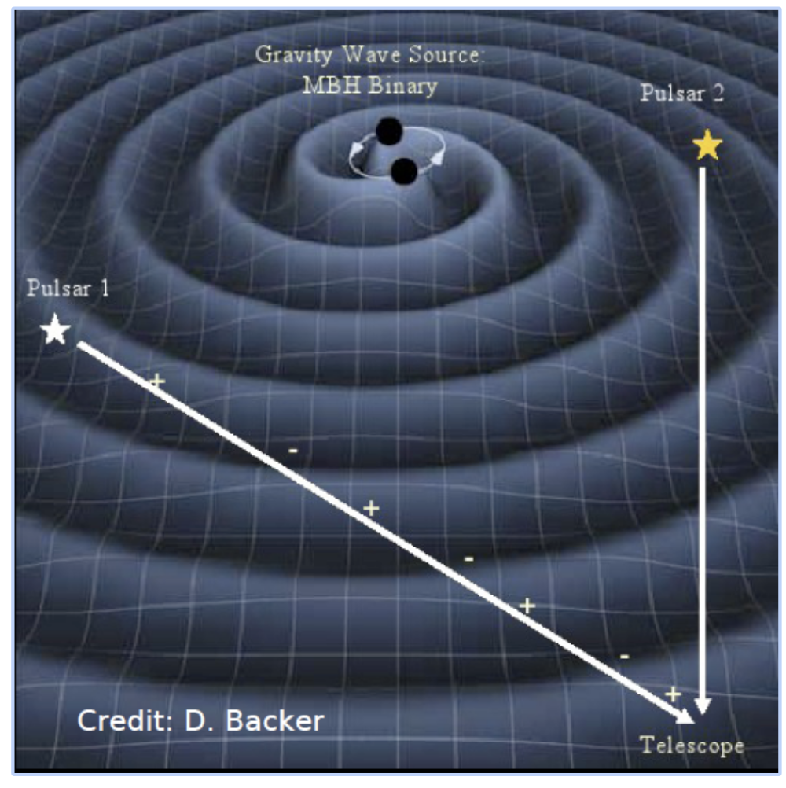

Gravitational waves, similar to electromagnetic waves (like gamma-rays, visual light, and radio waves), are emitted at many different frequencies. Experiments like LIGO detect high-frequency gravitational waves as stellar mass (a few - 10s of times the mass of the Sun) black holes and neutron stars merge. But other experiments are trying to detect gravitational waves at different frequencies. One type of experiment is called a pulsar timing array, which is sensitive to nanohertz gravitational waves from binary supermassive black holes (a million to a billion times the mass of the Sun) that are at the centers of some galaxies.

The way that pulsar timing arrays work, is, as the name suggests, one observes many pulsars, in this case millisecond pulsars, across the sky, and looks for the pulse signal to arrive earlier or later than expected as the gravitational waves squeeze and stretch the distance between the pulsar and Earth. A cartoon of this is shown below. The key to this detection is that which pulsars have pulses that arrive earlier or later should be [correlated](https://astrobites.org/2016/08/10/the-predictor-of-pulsar-timing/) depending on how large the angle between them is on the sky, so finding the same correlated signal across all the pulsars is key.

Image Credit: D. Backer

Another factor is that while there are many individual sources of these gravitational waves, the combined signal of all the different pairs of supermassive black holes in the Universe will be stronger than an individual signal, so that is what will likely be detected first. This is known as the stochastic gravitational wave background, and has not yet been detected, though [many different groups](http://ipta4gw.org/) are working on it.

Most of my research is with the [NANOGrav](http://nanograv.org/) collaboration, which is one pulsar timing array experiment. Most of my work involves timing the pulsars and investigating what additional noise, from the pulsar itself or from the interstellar medium, is also in the detector, and how can we model and mitigate it. While these nanohertz gravitational waves have not yet been detected, we are extremely optimistic that this will happen in the next few years!

