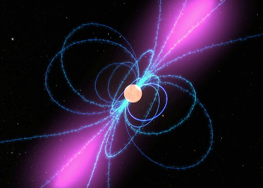
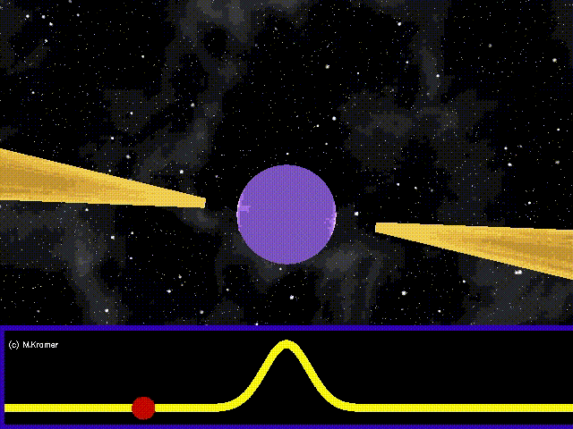

When large stars with masses about 8-20 times the mass of the Sun, or solar masses, run out of fuel and go supernova, their cores are so dense that they collapse in on themselves and form [neutron stars](https://imagine.gsfc.nasa.gov/science/objects/neutron_stars1.html). Neutron stars are so dense that all of the protons and electrons are effectively squished together into neutrons. They usually are about 1.4 solar masses, but are only about 20 km (this is about 12.5 miles) in diameter. This makes them the second densest objects in the universe, with one teaspoon of neutron star weighing about as much as Mt. Everest!

Stars also spin, so when you collapse them down to just 20 km, due to the conservation of angular momentum, they start to spin faster. How much faster? Well, neutron stars after they are born can make one full rotating in less than a second! They also have some of the strongest magnetic fields in the universe, coming in at ~1012 Gauss, which is about a hundred trillion times the strength of a neodymium magnet. 

Artist depiction of a neutron star from [www.nasa.gov](https://imagine.gsfc.nasa.gov/science/objects/neutron_stars1.html).

Even though neutron stars are small on an astronomical scale, they are extremely energetic, and have been found to emit X-rays and gamma-rays, and most notably for my research, radio waves. The neutron stars that are observed to emit radio waves are called [pulsars](https://www.space.com/32661-pulsars.html).

## Pulsars

Pulsars are neutron stars that are detected because they beam out radio emission like a lighthouse, as shown in the gif below (credit: Michael Kramer). 

When we observe the pulsar with a [radio telescope](https://public.nrao.edu/radio-astronomy/), the radio energy emitted as the beam passes over the telescope increases and then decreases, creating a pulse of radio emission. Hence the creative name pulsar. 

The cool thing about pulsars is that they are extremely periodic, which means we can predict when the pulses will arrive at Earth. Certain types of pulsars called [millisecond pulsars](https://phys.org/news/2016-10-millisecond-pulsars.html) (which make a full rotation in less than 30 ms) can even be predicted down to 10s of nanoseconds precision! The science of predicting these pulses is called [pulsar timing](https://astronomy.swin.edu.au/cosmos/P/Pulsar+Timing). If the pulse arrives earlier or later than we expect, and if we observe it at lots of radio frequencies, we can use pulsars to study the [interstellar medium](http://www-ssg.sr.unh.edu/ism/what1.html), which is all the gas and dust out in space, and even look for [gravitational waves](https://www.ligo.caltech.edu/page/what-are-gw), ripples in space-time caused by [supermassive black holes](https://astronomy.swin.edu.au/cosmos/s/supermassive+black+hole) at the centers of galaxies orbiting around each other!

